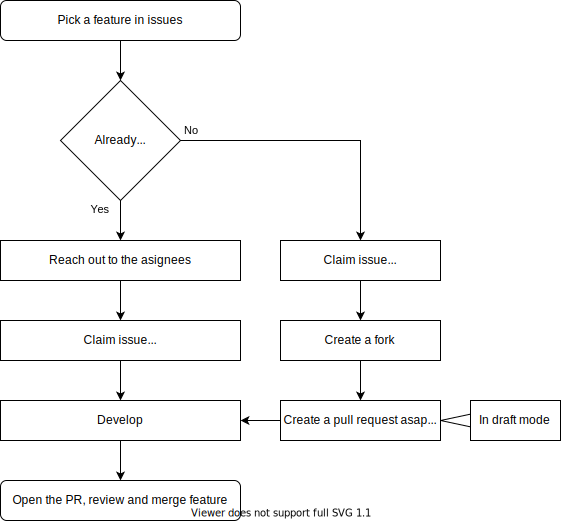
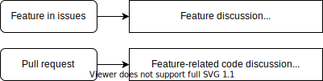

> This is not the bible, but sticking to this will ensure that you don't waste your time and talent.

## GitHub flow

If you're unfamiliar with the GitHub flow, [this](https://guides.github.com/introduction/flow/) is a good, 5 minute long introduction. We're using the **Fork & Pull** model.

**Issues** marked as feature are the base of our flow. These mark single bits of work (tasks, features) that can be done in parallel.
An overview of these can be found in [Development Tasks](https://github.com/wintergatan-community/virtual-mmx/projects/1).  
Features further down the line can be found on the [Brainstorming board](https://github.com/orgs/wintergatan-community/projects/1).

If someone wants to work on a feature, they should **comment "Claim"** to be assigned to the issue by a maintainer.

**Pull requests** (PR) should be created as soon as possible. It's a good idea to set them to [draft mode](https://help.github.com/en/github/collaborating-with-issues-and-pull-requests/about-pull-requests#draft-pull-requests "draft mode") since they'll be around for some time. Undo this once others should review and accept the PR.



:information_source: [Forks](https://help.github.com/en/github/getting-started-with-github/fork-a-repo) | [Creating a PR from a fork](https://help.github.com/en/github/collaborating-with-issues-and-pull-requests/creating-a-pull-request-from-a-fork)

While the issue is the place to discuss the feature, the PR is the place to discuss the code (usually between assignees).



:information_source: [GitHub Flavored Markdown](https://guides.github.com/pdfs/markdown-cheatsheet-online.pdf)

## Contributing

We use [TypeScript](https://www.typescriptlang.org/), [React](https://reactjs.org/) and [Bootstrap](https://getbootstrap.com/)

To aid our eyes, we use [Prettier](https://prettier.io/docs/en/editors.html) with the following `.prettierrc` configuration:

```json
{
	"useTabs": true
}
```

Use [eslint](https://eslint.org/) to highlight code problems.

> In the future, Prettier and eslint will be checked against before merging.

### How to start

To be able to build the project, you need to install [nodejs](https://nodejs.org/). Preferabily, you should use the latest LTS version, but you can also try the latest version if you want to.

Now, install the projects' dependencies by opening an command line, changing to your local checkout of the projects' directory and running `npm install`.

Afterwards, you can run the project with `npm start` and browsing to <http://localhost:3000/>. During development, your changes will directly be applied, so you only need to refresh the loaded page in your browser to get the latest updates.

## Introduce yourself

Feel free to introduce yourself in [issue #15](https://github.com/wintergatan-community/virtual-mmx/issues/15)!
